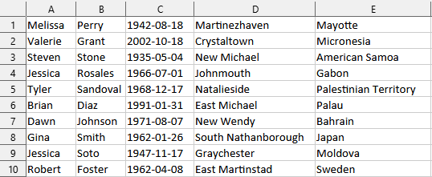

# Driver jdbc-sheets
JDBC driver for XLSX and others sheets reading

# Example

For example file `test-data.xlsx` with `Sheet1` and those data.

_The data are generated purely randomly using AI. It does not contain real personal data._



## Potencional query
```mysql
select 
    A as "Col1", B, C, D, E 
from 
    Sheet1 
limit 10 
offset 5;
```
WHERE conditions not supported, yet.

## Example how to read

```java
Class.forName("org.javerland.jdbcsheets.Driver");

try (Connection conn = DriverManager.getConnection("jdbc:sheets://?file=./test-data.xlsx")) {
    try (Statement stmt = conn.createStatement()) {
        try (ResultSet rs = stmt.executeQuery("select A as Col1, B, C, D, E from Sheet1 limit 5 offset 0")) {
            while (rs.next()) {
                String name = rs.getString("Col1");
                String surname = rs.getString(2); // Or "B"
                System.out.println(String.format("%s %s", name, surname));
            }
        }
    }
}

try (Connection conn = DriverManager.getConnection("jdbc:sheets://?database=test-data.xlsx&directory=./")) {
    // ... .. .
}
```

Output
```
Melissa Perry
Valerie Grant
Steve Stone
Jessica Rosales
Tyler Sandoval
```

# How to build

By Maven standard

```shell
mvn clean package
```

Or assembly single jar, with all dependencies

```shell
mvn clean package assembly:single
```
