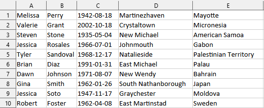

# jdbc-sheets

`jdbc-sheets` is a read-only JDBC 4.2 driver for querying XLSX worksheets with a small SQL subset.
Each worksheet is exposed as a table. By default, columns use Excel names (`A`, `B`, ..., `AA`);
the optional `header=true` connection property uses the first physical row as column names instead.

The driver requires Java 11 or newer. CSV and ODS are not currently supported.

## Dependency

```xml
<dependency>
    <groupId>org.javerland</groupId>
    <artifactId>jdbc-sheets</artifactId>
    <version>26.3.2</version>
</dependency>
```

The driver is registered through the standard JDBC service-provider mechanism, so an explicit
`Class.forName("org.javerland.jdbcsheets.Driver")` call is normally unnecessary.

## Usage

For a workbook containing a `Sheet1` worksheet:

```java
String url = "jdbc:sheets://?file=./test-data.xlsx";

try (Connection connection = DriverManager.getConnection(url);
     Statement statement = connection.createStatement();
     ResultSet result = statement.executeQuery(
             "select A as FirstName, B as LastName from Sheet1 limit 5 offset 0")) {
    while (result.next()) {
        System.out.printf("%s %s%n",
                result.getString("FirstName"), result.getString("LastName"));
    }
}
```

An alternative URL separates the directory and file name:

```text
jdbc:sheets://?database=test-data.xlsx&directory=./
```

To query a workbook whose first row contains column names:

```text
jdbc:sheets://?file=./people.xlsx&header=true
```

The header row is excluded from query results and type inference. Header names are matched without
regard to case, names containing spaces can be quoted (for example `"Full Name"`), and duplicate
names are rejected.

URL query values must be percent-encoded when they contain reserved characters such as `&` or `=`.

## Supported SQL

- `SELECT ... FROM worksheet`
- column aliases and worksheet aliases
- `*` and `alias.*`
- `LIMIT` and `OFFSET`
- `WHERE` expressions with parentheses, `AND`/`OR`, `=`, `!=`, `<>`, `<`, `<=`, `>`, `>=`,
  `LIKE`, `IS NULL`, and `IS NOT NULL`
- one-column `ORDER BY ... ASC|DESC`
- string concatenation with `||`
- `LOWER()` and `UPPER()` in `SELECT` and `WHERE`
- scalar parameters through `PreparedStatement`

Examples:

```sql
select A as FirstName, B from Sheet1;
select sheet.A, sheet.B from Sheet1 sheet;
select A || ' ' || B as FullName from Sheet1 limit 5;
select lower(A) as LowerName, upper(B) as UpperName from Sheet1;
select B from Sheet1 where B like 'Ali%';
select A, B from Sheet1 where A >= 18 and B is not null order by A desc;
select "Full Name", Age from People where Age >= ? order by Age;
```

`PreparedStatement` supports nulls, booleans, numbers, strings, JDBC date/time values, and URLs.
Parameters are safely quoted and validated before execution.

The driver does not currently support multi-column ordering, `GROUP BY`, `JOIN`, subqueries,
`DISTINCT`, writes, transactions, batches, binary/character streams, or callable statements.
Unsupported JDBC operations throw
`SQLFeatureNotSupportedException` instead of being silently ignored.

`LIKE` supports `%` and `_` and is case-sensitive. Numeric comparisons require numeric cell values.
Formula cells are evaluated when possible and otherwise use their cached value. Empty physical rows
are skipped. XLSX files are always opened in read-only mode. Column types are inferred in one pass;
columns containing incompatible value types are reported as `JAVA_OBJECT`.

## Build

Use the included Maven Wrapper:

```shell
bash mvnw verify
```

On Windows:

```powershell
.\mvnw.cmd verify
```

`verify` runs JUnit 5 tests, Mockito-based collaborator tests, JaCoCo coverage thresholds,
dependency analysis, and SpotBugs. Optional mutation testing can be run with:

```shell
bash mvnw -Pmutation test-compile pitest:mutationCoverage
```

To build a JAR containing all runtime dependencies:

```shell
bash mvnw package assembly:single
```

The dependency bundle is created as
`target/jdbc-sheets-26.3.2-jar-with-dependencies.jar`.

Release signing and Central publishing are isolated in the `release` Maven profile and require the
corresponding credentials and GPG key configuration.

## Test data

The sample data in `src/test/resources/test-data.xlsx` is randomly generated and does not contain
real personal data.



## License

Apache License 2.0. See [LICENSE](LICENSE).
